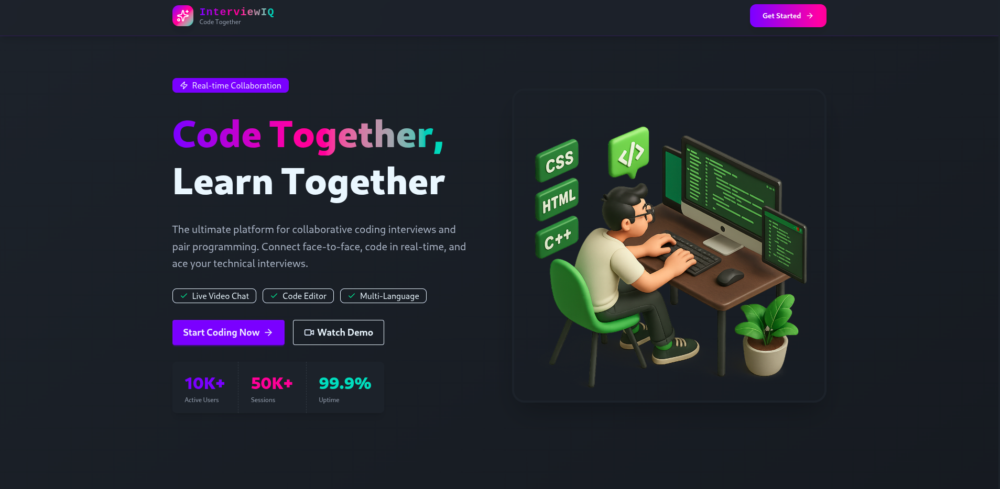

# InterviewIQ - Full-Stack Interview Platform

<div align="center">


### The Ultimate Platform for Technical Interviews & Coding Practice

[](https://reactjs.org/)
[](https://nodejs.org/)
[](https://www.mongodb.com/)
[](https://sevalla.app)

[](https://interviewiq-c1qah.sevalla.app)
[](#quick-start)

</div>


---

## 🏗️ Project Architecture

### 📁 Backend Structure
```
backend/
└── 📁src
    └── 📁controllers          # Business logic handlers
        ├── chatController.js  # Real-time chat functionality
        ├── sessionController.js # Session management
    └── 📁lib                 # Core libraries & configurations
        ├── db.js             # MongoDB connection
        ├── env.js            # Environment configuration
        ├── inngest.js        # Background jobs setup
        ├── stream.js         # Stream chat client
    └── 📁middleware          # Express middleware
        ├── protectRoute.js   # Authentication protection
    └── 📁models              # MongoDB schemas
        ├── Session.js        # Interview sessions
        ├── User.js           # User profiles
    └── 📁routes              # API route definitions
        ├── chatRoutes.js     # Chat endpoints
        ├── sessionRoute.js   # Session endpoints
    ├── server.js             # Express server entry point
```

### 📁 Frontend Structure
```
frontend/
└── 📁src
    └── 📁api                 # API client functions
        ├── sessions.js       # Session API calls
    └── 📁assets             # Static assets
        ├── react.svg
    └── 📁components         # Reusable React components
        ├── ActiveSessions.jsx    # Live sessions list
        ├── CodeEditorPanel.jsx   # Monaco code editor
        ├── CreateSessionModal.jsx # New session creation
        ├── Navbar.jsx            # Navigation header
        ├── OutputPanel.jsx       # Code execution results
        ├── ProblemDescription.jsx # Problem statements
        ├── RecentSessions.jsx    # Session history
        ├── StatsCards.jsx        # Dashboard metrics
        ├── VideoCallUI.jsx       # Video call interface
        ├── WelcomeSection.jsx    # Dashboard welcome
    └── 📁data               # Static data
        ├── problems.js      # Coding problems library
    └── 📁hooks              # Custom React hooks
        ├── useSessions.js   # Session state management
        ├── useStreamClient.js # Stream chat integration
    └── 📁lib               # Utility libraries
        ├── axios.js         # HTTP client configuration
        ├── piston.js        # Code execution service
        ├── stream.js        # Stream chat setup
        ├── utils.js         # Helper functions
    └── 📁pages             # Page components
        ├── DashboardPage.jsx    # Main dashboard
        ├── HomePage.jsx         # Landing page
        ├── ProblemPage.jsx      # Individual problem view
        ├── ProblemsPage.jsx     # Problems listing
        ├── SessionPage.jsx      # Live interview session
    ├── App.jsx             # Root component
    ├── index.css           # Global styles
    ├── main.jsx            # Application entry point
```

---

## 🚀 Quick Start

### Prerequisites

- Node.js 18+ 
- MongoDB Atlas account
- Clerk account
- Stream account
- Inngest account

### Environment Setup

#### Backend Configuration (`/backend/.env`)
```bash
# Server Configuration
PORT=3000
NODE_ENV=development
CLIENT_URL=http://localhost:5173

# Database
DB_URL=your_mongodb_connection_url

# Real-time Services
STREAM_API_KEY=your_stream_api_key
STREAM_API_SECRET=your_stream_api_secret

# Authentication
CLERK_PUBLISHABLE_KEY=your_clerk_publishable_key
CLERK_SECRET_KEY=your_clerk_secret_key

# Background Jobs
INNGEST_EVENT_KEY=your_inngest_event_key
INNGEST_SIGNING_KEY=your_inngest_signing_key
```

#### Frontend Configuration (`/frontend/.env`)
```bash
# API Configuration
VITE_API_URL=http://localhost:3000/api

# Authentication
VITE_CLERK_PUBLISHABLE_KEY=your_clerk_publishable_key

# Real-time Features
VITE_STREAM_API_KEY=your_stream_api_key
```

### Installation & Running

<div>

#### 🖥️ Backend Setup
```bash
cd backend
npm install
npm run dev
```
*Server starts on http://localhost:3000*

#### 🌐 Frontend Setup  
```bash
cd frontend  
npm install
npm run dev
```
*Client starts on http://localhost:5173*

</div>

---

## 🔧 Core Components Overview

### Backend Modules

#### 📋 Controllers
- **sessionController.js**: Manages interview session lifecycle
- **chatController.js**: Handles real-time messaging functionality

#### 🔌 Libraries
- **db.js**: MongoDB connection and configuration
- **stream.js**: Stream chat service integration
- **inngest.js**: Background job processing
- **env.js**: Environment variable validation

#### 🛡️ Middleware
- **protectRoute.js**: JWT authentication for protected routes

#### 🗂️ Models
- **Session.js**: Interview session schema with participants, code, and status
- **User.js**: User profile and preferences

### Frontend Components

#### 🎛️ Core UI Components
- **CodeEditorPanel.jsx**: Monaco editor with language support
- **VideoCallUI.jsx**: WebRTC video call interface
- **OutputPanel.jsx**: Code execution results display

#### 📊 Dashboard Components
- **StatsCards.jsx**: Metrics and analytics
- **ActiveSessions.jsx**: Live sessions monitoring
- **RecentSessions.jsx**: Session history

#### 🎪 Interactive Components
- **CreateSessionModal.jsx**: New session creation form
- **ProblemDescription.jsx**: Problem statement viewer

---

## 🎯 Key Features Implementation

### Real-time Code Collaboration
```javascript
// Frontend: CodeEditorPanel.jsx
const CodeEditorPanel = ({ sessionId, language, initialCode }) => {
  const [code, setCode] = useState(initialCode);
  
  // Real-time code synchronization
  useEffect(() => {
    const channel = streamClient.channel('code', sessionId);
    channel.on('code_updated', (event) => {
      setCode(event.code);
    });
  }, [sessionId]);
  
  return <MonacoEditor value={code} onChange={handleCodeChange} />;
};
```

### Video Call Integration
```javascript
// Frontend: VideoCallUI.jsx
const VideoCallUI = ({ sessionId, user }) => {
  const [localStream, setLocalStream] = useState(null);
  const [remoteStream, setRemoteStream] = useState(null);
  
  // WebRTC peer connection setup
  const setupCall = async () => {
    const stream = await navigator.mediaDevices.getUserMedia({
      video: true,
      audio: true
    });
    setLocalStream(stream);
  };
  
  return (
    <div className="video-grid">
      <video ref={localVideoRef} autoPlay muted />
      <video ref={remoteVideoRef} autoPlay />
    </div>
  );
};
```

### Session Management
```javascript
// Backend: sessionController.js
const createSession = async (req, res) => {
  const { createdBy, problemId, language } = req.body;
  
  const session = await Session.create({
    createdBy,
    problemId,
    language,
    participants: [createdBy],
    status: 'waiting',
    code: getStarterCode(language)
  });
  
  // Create Stream chat channel
  await streamClient.channelCreate({
    id: session._id.toString(),
    members: [createdBy],
    name: `Interview Session ${session._id}`
  });
  
  res.status(201).json(session);
};
```

---

## 🌐 Deployment on Sevalla

### Current Deployment
- **Live URL**: https://interviewiq-c1qah.sevalla.app/
- **Platform**: Sevalla (Free Tier)
- **Status**: ✅ Live & Running

### Production Build
```bash
# Build frontend for production
cd frontend
npm run build

# Start backend in production mode
cd ../backend
NODE_ENV=production npm start
```

### Environment Variables for Production
```bash
NODE_ENV=production
CLIENT_URL=https://interviewiq-c1qah.sevalla.app
DB_URL=your_production_mongodb_url
```

---

## 🔄 API Endpoints

### Session Routes (`/api/sessions`)
- `POST /` - Create new interview session
- `GET /` - List user's sessions
- `GET /:id` - Get session details
- `PUT /:id/join` - Join existing session
- `PUT /:id/code` - Update session code

### Chat Routes (`/api/chat`)
- `POST /:sessionId/message` - Send chat message
- `GET /:sessionId/messages` - Get message history

---

## 🛠️ Development Scripts

### Backend
```bash
npm run dev          # Development server with hot reload
npm start           # Production server
npm test            # Run test suite
```

### Frontend
```bash
npm run dev          # Vite development server
npm run build        # Production build
npm run preview      # Preview production build
```

